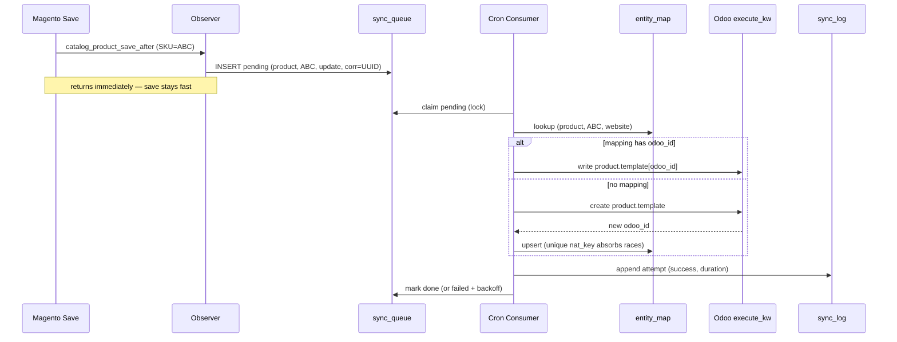
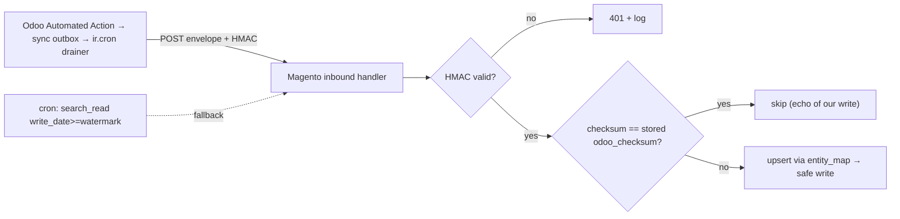

# Odoo ERP ↔ Magento 2 — Bidirectional Integration Architecture

> **Status:** Design (for review) · **Date:** 2026-06-01 · **Source task:** ClickUp [86d364zz0](https://app.clickup.com/t/86d364zz0) (Amira Khalifa, Magento Egypt)
> **Target:** Magento 2.4.3-p1 Open Source, PHP 7.4, CedCommerce multi-vendor (`baw_org`), vendor namespace `MagentoEgypt`. **Odoo 16.0 Enterprise Edition (16.0+e)** — external API via XML-RPC/JSON-RPC `execute_kw`.
> **Provenance:** every environment claim is read directly from `db_schema.xml` / `InstallSchema.php` / `config.php` / `env.php` on this install (see §0); it is not assumed.

This document specifies a **bidirectional** synchronization between an **Odoo 16 Enterprise** ERP and this **Magento 2** storefront across five domains (products, customers, orders, inventory, reports) with **no duplicate records**, error logging/monitoring, retry, audit/history, conflict resolution, and **multi-store** support. Commissions and promotions are **deferred but accommodatable** (§13).

The design is shaped by three facts about *this* install:
1. **CedCommerce multi-vendor marketplace** — a Magento order splits into per-vendor sub-orders, and products are vendor-owned, which changes how orders/products map to Odoo.
2. **MSI is active** — inventory's atomic unit is `source_code`+`sku`, not legacy stock.
3. **Open Source (no Adobe Commerce webhooks)** — outbound real-time must be observer-driven; a custom DB queue + cron is the right fit.

---

## 0. Verified environment baseline

| Fact | Source |
|---|---|
| Magento **2.4.3-p1 Open Source**, PHP 7.4.33, developer mode, RDS `baw_org`, Redis, Varnish | `composer.json`, `app/etc/env.php` |
| **MSI active** (`Magento_Inventory*` enabled); `Magento_WebapiAsync` + `Magento_AsynchronousOperations` enabled; **`Magento_AdobeCommerceWebhooks` absent** | `app/etc/config.php` |
| Queue: `consumers_wait_for_messages=1`, `Magento_MysqlMq` (db queue) real; `Magento_Amqp` loaded but **no broker configured** | `app/etc/env.php`, `config.php` |
| Product→vendor is **1:1** — unique `CED_CSMARKETPLACE_VENDOR_PRDS_PRD_ID` on `product_id` | `vendor/ced/marketplace-basic/src/module-csmarketplace/etc/db_schema.xml:291` (table @267, FK @290) |
| Orders **split per vendor** — unique `…VENDOR_SALES_ORDER_VENDOR_ID_ORDER_ID` on `vendor_id`+`order_id` | same file `:251` (table @212) |
| Vendor = `ced_csmarketplace_vendor` (`parent_id`→`customer_entity.entity_id`, `website_id`) | same file (vendor table + EAV) |
| `sales_order_item` gains `vendor_price`, `admin_sku`, `not_vendor_price` | `app/code/MagentoEgypt/CsComissionExtend/etc/db_schema.xml` |
| Commissions: rules `cscommission_commission`; per-item `ced_cstransaction_vorder_items`; payouts `ced_csmarketplace_vendor_payments` | `vendor/ced/module-cscommission`, `vendor/ced/module-cstransaction` schemas |
| **House outbound-integration reference = `MagentoEgypt_Khazenly`**: store-scoped `system.xml` (secrets `type="text"`, **plaintext** — `system.xml:15`); cURL Bearer + refresh-on-`INVALID_SESSION_ID`-retry; `CsrfAwareActionInterface` callback matched on a stored reference; config-gated PSR logging | `app/code/MagentoEgypt/Khazenly/{Helper/Data.php,etc/adminhtml/system.xml,Controller/Callback/Success.php,etc/db_schema.xml}` |
| **Known prior incidents** at this install: `catalog_product_link_type` and `sales_sequence_profile` were emptied → hard constraint that the integration never regenerates increment IDs / touches sequence tables | `vendor/magento/module-sales-sequence` schema + incident history |

**House conventions to follow** (verified across 19 `MagentoEgypt` modules): declarative `etc/db_schema.xml` + `db_schema_whitelist.json`; `Setup/Patch/Data` (`DataPatchInterface`); credentials in `system.xml` read via Helper with `ScopeInterface::SCOPE_STORE`; constructor DI; `declare(strict_types=1)` on new files; ACL on every admin action; `StoreManagerInterface` for all store/website IDs.

---

## 1. Solution overview

Two cooperating modules plus a shared contract:

1. **`MagentoEgypt_OdooConnector`** (Magento) — owns three tables (entity map, sync queue, sync log), observers that **enqueue** outbound changes, a cron consumer that drains the queue and calls Odoo, an HMAC-verified inbound surface Odoo calls, store-scoped `system.xml`, and a dedicated `odoo_sync.log` channel.
2. **Odoo addon `magentoegypt_connector`** (Odoo 16 EE) — a thin mirror: an Automated Action + outbox model + `ir.cron` drainer, a mapping mirror, the HMAC signer; maps Magento domains to standard Odoo models and pushes Odoo-side changes to Magento.
3. **Shared sync contract** — a versioned JSON envelope: `correlation_id`, `entity_type`, `operation`, natural key, `source_system`, `checksum`, `payload`, `idempotency_key`. Symmetric dedup on both sides.

Follows the Khazenly pattern (store-scoped config via Helper+`SCOPE_STORE`; cURL Bearer with refresh-and-retry; `CsrfAwareActionInterface` callback with reference-match idempotency; config-gated logging) and **improves** on it (encrypted secrets, HMAC on inbound, dedicated tables, dedicated log channel).

```mermaid
flowchart LR
  subgraph MAG["Magento 2.4.3-p1 (MagentoEgypt_OdooConnector)"]
    OBS["Domain Observers<br/>(catalog_product_save_after, etc.)"]
    Q[("magentoegypt_odoo_sync_queue")]
    MAP[("magentoegypt_odoo_entity_map")]
    LOG[("magentoegypt_odoo_sync_log")]
    CONS["Cron Consumer<br/>+ Retry + Reconcile"]
    IN["Inbound REST / Controller<br/>(HMAC verified)"]
    CFG["system.xml<br/>(store-scoped, encrypted)"]
    OBS -->|enqueue| Q
    CONS -->|drain| Q
    CONS --> MAP
    CONS --> LOG
    IN --> MAP
    IN --> LOG
    IN -->|safe writes| MAG
  end
  subgraph ODOO["Odoo 16.0 EE (magentoegypt_connector addon)"]
    OAPI["External API<br/>/xmlrpc/2/object · execute_kw"]
    OQ["Automated Action → sync outbox<br/>+ ir.cron drainer (HMAC POST)"]
  end
  CONS -->|"outbound: create/write (execute_kw)"| OAPI
  OQ -->|"inbound: POST envelope"| IN
  CFG -.->|credentials,toggles| CONS
  CFG -.-> IN
```

## 2. Core anti-duplication design — `magentoegypt_odoo_entity_map`

The centerpiece. Single correlation between a Magento record and its Odoo counterpart. Every create/update on either side consults it first; a far-side record is created **only if no mapping row exists for that natural key+scope**.

**Columns:** `map_id` (PK), `entity_type` (`product`|`customer_buyer`|`customer_vendor`|`order`|`order_vendor`|`inventory_source_item`|`category`|`commission`*|`promotion`* — *=reserved/deferred), `magento_id` (varchar, NULL until exists), `magento_natural_key` (varchar — SKU / `email` / order `increment_id` / `source_code:sku` / `url_key`), `odoo_model`, `odoo_id` (NULL until exists), `website_id`, `store_id`, `odoo_company_id`, `vendor_id` (= `ced_csmarketplace_vendor.entity_id` when vendor-scoped), `last_direction` (`m2o`|`o2m`), `magento_checksum` (sha256), `odoo_checksum` (sha256), `magento_updated_at`, `odoo_write_date`, `sync_status` (`linked`|`pending`|`conflict`|`error`), `last_correlation_id`, `created_at`, `updated_at`.

**Uniqueness (guarantees idempotency):**
- `UNIQUE (entity_type, magento_id, website_id)` — ≤1 row per Magento entity per scope.
- `UNIQUE (entity_type, odoo_model, odoo_id, website_id)` — ≤1 row per Odoo record per scope.
- `UNIQUE (entity_type, magento_natural_key, website_id)` — **the dedup keystone**; two events for the same SKU/email/increment_id collapse to one row even out-of-order.
- Plus `KEY` on `vendor_id`, `sync_status`, `last_correlation_id`.

**Why it stops dupes both ways:**
- **M→O:** before `create` in Odoo, look up `(entity_type, natural_key, website_id)`. Non-NULL `odoo_id` ⇒ `write` (never create). NULL `odoo_id` (inbound race) ⇒ attach. No row ⇒ `create`, then `INSERT … ON DUPLICATE KEY UPDATE` the map — the unique key absorbs the race so two concurrent saves can't mint two Odoo records.
- **O→M:** symmetric; respects the verified `ced_csmarketplace_vendor_products` unique `product_id` (one product = one vendor) — inbound products attach to an existing vendor product, never spawn a second.

**Three layers combine:**
- **`correlation_id`** (UUID) threads one logical change through queue→HTTP→log→response. One change, one id, end-to-end.
- **`idempotency_key`** = `hash(entity_type+natural_key+operation+source_checksum)`; a redelivered envelope with the same key is a no-op (`skipped`). Wire-level guard.
- **`checksum`** (sha256 of canonicalized payload): if an inbound change's checksum equals our stored far-side checksum, it's an **echo of our own write** → drop. This kills the bidirectional ping-pong loop. Storage-level + echo guard atop the unique index.

## 3. Sync queue — `magentoegypt_odoo_sync_queue`

Observers enqueue; cron drains. **Columns:** `queue_id` (PK), `entity_type`, `magento_id`, `odoo_id`, `website_id`, `vendor_id`, `direction` (`m2o`|`o2m`), `operation` (`create`|`update`|`delete`|`status`|`price`|`stock`), `payload` (longtext JSON), `correlation_id`, `idempotency_key`, `status` (`pending`|`processing`|`done`|`failed`|`skipped`), `attempts`, `max_attempts` (def 5), `last_error`, `scheduled_at` (backoff target), `locked_at` (claim marker), `priority`, `created_at`, `updated_at`.

**Indexes:** `idx_claim (status, scheduled_at, priority)`; `idx_corr`; `idx_entity (entity_type, magento_id)`; `idx_lock (locked_at)`; `idx_dedupe (entity_type, magento_id, operation, status)` to coalesce repeated saves before send.

**Payload note:** prefer storing a lean key-set + re-resolving the full payload at send time (freshest data, never stale); keep a full envelope only for `delete`/`status` where the source row may vanish.

**Why a custom table, not Magento MessageQueue:** the brief requires first-class retry/attempts/audit/conflict columns; the custom table gives SQL-visible `attempts`/`last_error`/`status`, per-row `scheduled_at` backoff, and joins to `entity_map`/`sync_log` — none native to MessageQueue. No broker exists here anyway (AMQP unconfigured). **Scaling option (not v1):** the enabled `WebapiAsync`/`AsynchronousOperations` can later carry bulk ops, or the consumer can ride MessageQueue topics, while this table stays the retry/audit system-of-record.

## 4. Audit / history — `magentoegypt_odoo_sync_log`

Append-only, **one row per attempt** (full trail under one `correlation_id`). **Columns:** `log_id` (PK), `correlation_id`, `entity_type`, `magento_id`, `odoo_id`, `website_id`, `direction`, `operation`, `request_snippet` (secrets redacted), `response_snippet`, `http_status`, `result` (`success`|`failed`|`skipped`|`retry`), `attempt_no`, `duration_ms`, `created_at`. Indexes on `correlation_id`, `(entity_type, magento_id)`, `created_at`, `result`. In parallel, human-readable lines → `var/log/odoo_sync.log` via a Monolog `virtualType` in `di.xml` (improves on Khazenly's shared logger). Both gated by the config log-level.

## 5. Real-time outbound (Magento → Odoo)

Adobe webhooks are absent ⇒ **observer-driven**. Each observer only **enqueues** (never calls Odoo inline) — keeps saves fast, retryable, and resilient to Odoo downtime.

| Domain | Event(s) | Enqueues |
|---|---|---|
| Products | `catalog_product_save_after`, `catalog_product_delete_after` | `product` |
| Product↔vendor | save of `ced_csmarketplace_vendor_products` | enrich with `vendor_id` |
| Customers | `customer_save_after`, `customer_delete_after` | `customer_buyer` |
| Vendors | `ced_csmarketplace_vendor` save | `customer_vendor` |
| Orders | `sales_order_save_after`, `sales_order_place_after` | `order` (+ fan-out `order_vendor`, §8) |
| Inventory (MSI) | MSI source-item save (`SourceItemsSaveInterface` plugin) **and** `cataloginventory_stock_item_save_after` | `inventory_source_item` |



## 6. Inbound (Odoo → Magento) — hybrid

**A · Push (near-real-time, Enterprise-native):** an Odoo **Automated Action** (`base_automation`) on `create`/`write`/`unlink` of mapped models fires a **Server Action** that writes a row to a custom **`magentoegypt.sync.outbox`** model (symmetric to the Magento queue); an Odoo **Scheduled Action (`ir.cron`, ~1 min)** drains the outbox and POSTs the HMAC-signed (`X-Odoo-Signature` = HMAC-SHA256(body, shared_secret)) envelope to a Magento `CsrfAwareActionInterface` controller (like Khazenly's `Callback\Success`) or `webapi.xml` endpoint. This keeps HTTP **out of the user's Odoo transaction** and gives native retry/backoff (`attempts`/`last_error` columns on the outbox row). Idempotency via natural-key lookup in `entity_map`. **Echo prevention:** Magento→Odoo writes pass context `{'magento_sync': True}` so the Automated Action skips re-emitting (belt-and-suspenders with the checksum skip below).

**B · Pull (catch-all):** Magento cron `search_read` on Odoo filtered by `write_date >= watermark` per model; resilient to missed pushes / brief downtime.

**Recommendation: hybrid** — A for latency, B as safety net/reconciliation; both funnel through one inbound handler ⇒ one dedup path. This is how "real-time" is achieved without Adobe webhooks.



## 7. Scheduled reconciliation + retry (`crontab.xml`)

| Job | Schedule | Action |
|---|---|---|
| `odoo_queue_consumer` | `* * * * *` | claim `pending` where `scheduled_at<=now`, send, mark `done`/`failed` |
| `odoo_retry_failed` | every 5 min | reclaim `failed` with `attempts<max`; `scheduled_at = now + 2^attempts min` (capped); at max → dead-letter (surfaced in admin grid + optional alert) |
| `odoo_reconcile_products` | hourly | checksum/watermark compare + unmapped SKUs both sides → enqueue fixes |
| `odoo_reconcile_customers` | every 2h | same, `res.partner` by `email+website_id` |
| `odoo_reconcile_inventory` | every 15 min | MSI `source_code+sku` vs Odoo `stock.quant` (drifts fastest) |
| `odoo_reconcile_orders` | every 30 min | verify each `increment_id` + per-vendor sub-orders has Odoo `sale.order`(s); **read-only verify + enqueue missing creates only — never rewrites increment_ids** |
| `odoo_pull_watermark` | every 10 min | Option-B pull per enabled domain |
| `odoo_queue_cleanup` | daily 03:00 | purge old `done`/`skipped`, archive old `sync_log`; keep `entity_map` forever |

## 8. Per-domain design

Proposed system-of-record marked **(CONFIRM)** — for the requester to ratify (§16).

- **Products** — `catalog_product_entity`(+EAV)+`ced_csmarketplace_vendor_products` ↔ `product.template`/`product.product`. Key **SKU**(+entity_id). One product→one vendor (verified unique `product_id`); Odoo product carries vendor context; inbound never creates a 2nd vendor-product row. **SoR (CONFIRM):** field-split — catalog content (name/desc/media/status)=**Magento**; cost & stock=**Odoo**; **sale price = OPEN** (config-selectable). Bidirectional, field-scoped.
- **Customers** — `customer_entity` (buyers) + `ced_csmarketplace_vendor` (vendors) ↔ `res.partner`. Key **email+website_id**. Buyers→customer rank; vendors→supplier rank (`parent_id` chain mirrored); `entity_type` keeps `customer_buyer`≠`customer_vendor` so they never collide on email. **SoR (CONFIRM):** Magento for buyers; Odoo for vendor master/financial, Magento for vendor storefront fields. Bidirectional.
- **Orders** — `sales_order`/`sales_order_item` (+`CsComissionExtend` `vendor_price`/`admin_sku`) + split `ced_csmarketplace_vendor_sales_order` ↔ `sale.order`/`sale.order.line`. Key **increment_id**(+vendor_id for sub-orders). **Granularity (CONFIRM):** default **one Magento order → N Odoo `sale.order`s, one per vendor** (from the verified per-vendor split), enabling per-vendor invoicing/payouts in the deferred commission phase; map uses `entity_type='order'` (master) + `order_vendor` (per sub-order). Alternative single master order is simpler but blocks per-vendor financials. **SoR: Orders = Magento authoritative, always**; M→O only for facts; O→M limited to **additive** status/tracking write-backs (mirrors Khazenly writing only `custom_shipment_status`). **Hard rule:** never generate/alter `increment_id`; never touch `sales_sequence_profile`/`sales_sequence_meta`/`catalog_product_link_type` (prior-incident tables); O→M writes are additive via `OrderRepositoryInterface::save`.
- **Inventory** — MSI `inventory_source_item` (`source_code`+`sku`→qty; legacy `cataloginventory_stock_item` secondary) ↔ `stock.quant`/`stock.move`. Key **source_code+sku**. **SoR (CONFIRM):** **Odoo authoritative** (ERP owns stock); primarily O→M via the **MSI API** (not raw DB); M→O for storefront reservations if Odoo isn't fulfillment brain. Flips if vendors stock in Magento.
- **Reports / Analytics** — sales/catalog aggregates ↔ Odoo reporting/`account.move`. **SoR: one-way Magento → Odoo export** (or Odoo pulls); no write-back; lowest risk; validates the pipeline.

## 9. Conflict resolution matrix

`updated_at`/`write_date` are per-row watermarks; `entity_map` stores both checksums. **Detection:** if *both* checksums diverged since last sync → `sync_status='conflict'`, apply tie-break. **Echo suppression:** only inbound checksum changed and equals our last write → `skipped`.

| Domain | System of record | Tie-break | Notes (PROPOSED — confirm) |
|---|---|---|---|
| Products — catalog content | Magento | Magento wins | name/desc/media/status |
| Products — cost & stock | Odoo | Odoo wins | |
| Products — sale price | **OPEN** | last-write-wins by max(updated_at, write_date) | config `product_price_owner` |
| Customers — buyers | Magento | Magento wins | |
| Customers — vendor master/financial | Odoo | Odoo wins | |
| Customers — vendor storefront | Magento | Magento wins | |
| Orders | Magento | Magento always; O→M additive status only | never rewrite increment_id/sequences |
| Inventory | Odoo | Odoo wins | flip if vendors stock in Magento |
| Reports | Magento | one-way; no conflict | |

Field-level authority beats blanket last-write-wins where an owner is clear; LWW by later watermark is the fallback only for genuinely shared fields. Unresolvable conflicts surface in an admin grid for manual resolution.

## 10. Multi-store handling

`ced_csmarketplace_vendor` and `ced_csmarketplace_vendor_sales_order` both carry `website_id` (FK `store_website`); single domain `brassandwood.net` but website scoping is real. `system.xml` fields use `showInWebsite/showInStore` (matching Khazenly) ⇒ per-website Odoo creds, per-domain toggles, and **per-website→Odoo company** mapping. `website_id`/`store_id` are columns on all three tables; uniqueness keys scoped by `website_id` so the same SKU/email in two websites maps to two Odoo records under two companies without collision. `StoreManagerInterface` resolves all ids (house convention). **Build prerequisite:** confirm the store tree via `bin/magento store:list` before wiring company mapping. Odoo 16.0 EE multi-company cleanly backs the per-website→`company_id` mapping.

## 11. Configuration (`system.xml`, section `odooconnector`, store-scoped)

- **connection:** `odoo_url`, `odoo_db`, `api_user`, `api_key` (**obscure + `backend_model=…Encrypted`**; = an Odoo **API key** per integration user, not the password — improves on Khazenly plaintext), `auth_protocol` (XML-RPC|JSON-RPC), `inbound_shared_secret` (encrypted, HMAC), `test_connection` (button → controller doing `execute_kw common.version`/auth, mirrors Khazenly's button).
- **domains:** `enable_{products,customers,orders,inventory,reports}`; `conflict_rule_{products,customers,inventory}` (magento_wins|odoo_wins|last_write_wins|field_level); `product_price_owner` (magento|odoo); `order_granularity` (per_vendor|master, default per_vendor).
- **processing:** `batch_size`, `max_attempts`, `backoff_base_minutes`, `pull_enabled`, watermark state.
- **logging:** `log_level` (OFF/ERROR/INFO/DEBUG), read-only `callback_url` info field.

All read via one Helper with `XML_PATH_ODOO='odooconnector/'` + `SCOPE_STORE`.

## 12. Odoo side — **Odoo 16.0 Enterprise**

- **Auth:** dedicated **integration user** + **Odoo API key** (Settings → Users → API Keys; requires developer mode) — *not* the user password; maps to the encrypted `api_key` config field. Note: an EE integration user consumes a licensed seat — flag to the Odoo admin.
- **M→O writes:** standard Odoo external API — XML-RPC `/xmlrpc/2/object` `execute_kw(db, uid, api_key, model, method, args, {context})` (or JSON-RPC, config-selectable); stable in 16.0. All writes pass `context={'magento_sync': True}` for echo prevention (§6).
- **O→M push (Enterprise-native, recommended):** addon `magentoegypt_connector` ships **Automated Action + Server Action → `magentoegypt.sync.outbox` model + `ir.cron` drainer** (symmetric to the Magento queue; native to EE, no OCA dependency). The addon also holds the **mapping mirror** (Magento id/website ↔ Odoo id), the HMAC signer, and small custom fields where needed. **Optional hardening:** OCA `queue_job` (installable on EE) for instant, non-polled processing instead of the 1-min cron — adopt only if the team accepts an OCA addon.
- **Domain→model:** products→`product.template`/`product.product`; customers→`res.partner` (customer vs vendor/supplier rank); orders→`sale.order`/`sale.order.line`; inventory→`stock.quant`/`stock.move` (EE WMS-capable); reports→reporting/`account.move`.
- **EE bonus:** full Accounting (`account.move`, vendor bills) and robust multi-company are first-class in 16.0 EE — directly benefits the deferred commissions phase (§13) and the per-website→company mapping (§10).

## 13. Deferred commissions & promotions (out-of-scope, accommodatable)

`entity_type` already reserves `commission`/`promotion`, so enabling later is additive (no schema change). **Commissions** → `ced_cstransaction_vorder_items` (`order_item_id`,`vendor_id`,`item_fee`,`item_commission`) + payout ledger `ced_csmarketplace_vendor_payments` + rules `cscommission_commission` → Odoo **vendor bills (`account.move`, `move_type='in_invoice'`)** per vendor — natively supported by EE 16.0 full Accounting and aligned with the per-vendor `sale.order` choice. **Promotions** → `salesrule`/`catalogrule` → Odoo **pricelists/coupons**. Both **explicitly out-of-scope pending requester confirmation**; architecture only guarantees no redesign is needed to add them.

## 14. Phased build order (roadmap)

1. **Foundation** — scaffold `MagentoEgypt_OdooConnector`; declarative schema + whitelist for the 3 tables; `system.xml`+Helper (encrypted creds, `SCOPE_STORE`); `odoo_sync.log` channel; `test_connection`; ACL.
2. **Products read-only O→M** — prove dedup end-to-end (one map row, no dup on repeat).
3. **Products write-back M→O** — `catalog_product_save_after` observer → enqueue → consumer; validate echo-suppression (no ping-pong).
4. **Customers** — buyers + vendors; email+website_id keying; buyer/vendor distinction.
5. **Inventory** — MSI source-item; O→M on-hand via MSI API.
6. **Orders (last, most stateful)** — per-vendor fan-out; additive-only write-back; sequence/increment guards.
7. **Reconcile/retry/audit hardening** — all §7 crons, dead-letter, admin grids over the 3 tables.
8. **Reports** — one-way export, acceptance checks.
9. **Commissions/promotions** — only after requester confirmation.

## 15. Verification strategy (build phase, Odoo access available)

- **Install:** `setup:upgrade` → `setup:di:compile`; confirm 3 tables created + whitelisted.
- **Dedup both ways, per domain:** create/update in each system; assert exactly one `entity_map` row per natural key+scope and exactly one far-side record; repeat the change → assert **no second record** (idempotency via unique natural-key index + checksum skip).
- **Retry:** point Odoo at a dead host/revoke key → row goes `failed`, `attempts` increments, `scheduled_at` backs off; restore → retry cron drives to `done`; `sync_log` shows full attempt trail under one `correlation_id`.
- **Reconcile:** skip an observer, run domain reconcile → detects drift via checksum/watermark, enqueues fix, ends at zero discrepancies/dupes.
- **Orders safety:** create an order → N per-vendor `sale.order`s appear; assert `increment_id`, `sales_sequence_profile`, `catalog_product_link_type` **untouched**.
- **Multi-store:** with store tree confirmed, same SKU/email under two websites → two map rows (distinct `website_id`/`odoo_company_id`), two Odoo records under mapped companies, no collision.

## 16. Open questions / prerequisites for the requester (Amira)

1. ~~Odoo version + edition~~ — **RESOLVED: Odoo 16.0 Enterprise (16.0+e).** Push mechanism set to EE-native Automated Action + `magentoegypt.sync.outbox` + `ir.cron` (§12); auth via Odoo API key.
2. **Per-domain system-of-record** (§9 proposals), especially **product sale-price owner**.
3. **Order granularity** — confirm one order → N per-vendor `sale.order`s (default) vs single master.
4. **Inventory authority** — Odoo authoritative (default) vs flip if vendors stock in Magento.
5. **Customers** — buyers AND vendors both as `res.partner`, or buyers excluded? Vendor rank/financial-field ownership.
6. **Store/website tree** — confirm via `bin/magento store:list`; map each website → Odoo company.
7. **Deferred scope** — confirm commissions & promotions stay out of v1.
