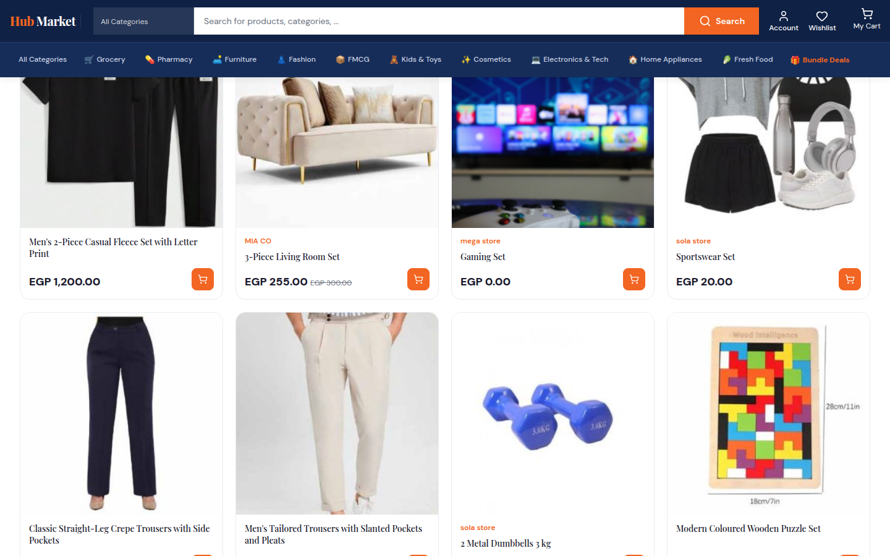
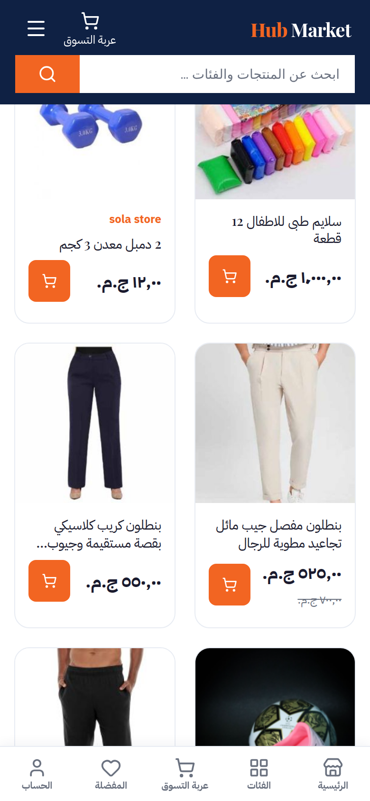

# DEV07 — Algolia Recommendations (Hub Market)

Algolia app **HL67ED06DQ** (Grow Plus), indices `hubmarket_en_products` / `hubmarket_ar_products`.
Extension: `algolia/algoliasearch-magento-2` 3.18.1; storefront rendering overridden in the
`MagentoEgypt/hub-market` theme.

## Models (Algolia dashboard → Recommend → Models)

| Model | EN | AR | Status 2026-09-24 | Data it needs |
|---|---|---|---|---|
| Related items (content-based: `name`, `description`) | trained | training | **live** on PDP | none (collaborative mode: 10,000 events / 30 days) |
| Looking similar (`image_url`) | training | training | trained, not placed | product images only |
| Frequently bought together | not trainable yet | not trainable yet | **hidden** until trained | 1,000 multi-item orders / 30 days (now: 4) |
| Trending items | not trainable yet | not trainable yet | **hidden** until trained | 250 conversions / 30 days (now: 9) |

FBT and Trending start working with no code change once Algolia trains them — the dashboard shows
"Events requirement not yet met" with a counter until then. Historical orders can be uploaded as a CSV
of past events on the same page to speed this up.

## Placements

| Page | Block | Where it is set |
|---|---|---|
| Product page | Frequently bought together (4) + Related products (8) | Stores → Config → Algolia → Recommend (website *Hub Market*) |
| Cart | Frequently bought together | same config (`…enabled_in_cart_page`) |
| Home | Trending items (8), after Best Selling Items | `hub-market/Algolia_AlgoliaSearch/layout/cms_index_index.xml` |
| Category | Trending items **in that category** (4), under the listing | `…/layout/catalog_category_view.xml` + `templates/recommend/widget/hm-category-trends.phtml` (facet `categoryIds:<id>`) |

All blocks:
- load asynchronously (RequireJS after the page) — no effect on first paint;
- render **nothing** when the model has no results (including untrained models — the Recommend
  client is wrapped so a 404 is "no recommendations", not a console error);
- exclude the current product (Recommend never returns the input items) and out-of-stock products
  (they are not in the Algolia index);
- use the theme's own product cards (`web/js/template/recommend/products.js`, `_hm-recommend.less`),
  4 across on desktop / 2 on phones, RTL in Arabic. The extension's `recommend.css` is removed.

## Tracking (Analytics)

Every carousel is requested with `clickAnalytics` (+ the shopper's token with cookie consent):
- clicking a card sends **Recommended Product Clicked** with `queryID` + position;
- card links and Add to Cart carry the `queryID`, so add-to-cart / purchase conversions are attributed.
Check in Dashboard → Data sources → Events → Debugger, and Recommend → Analytics.

## Merchandising rules

Recommend → Rules: `hm-exclude-zero-price` on Related / FBT / Looking similar (EN + AR) — never
recommend items priced 0. (Trending models do not support Recommend rules.) Add pins, hides or
filters per model from the same screen.

## Managing it

- Turn a placement on/off or change counts/titles: Magento admin → Stores → Configuration → Algolia
  Search → Recommend (website scope *Hub Market*); then flush cache + purge Varnish.
- Arabic titles come from `hub-market/i18n/ar_SA.csv` ("Frequently bought together", "Related
  products", "Trending items").
- A/B test: Dashboard → A/B Testing once there is traffic (not started — see the handover note).

